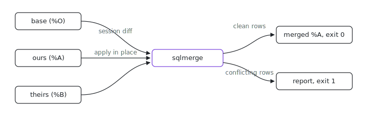

> [!NOTE]
> [`indexable-inc/sqlmerge`](https://github.com/indexable-inc/sqlmerge) is a read-only mirror, generated from [`packages/sqlmerge`](https://github.com/indexable-inc/index/tree/d907dd6fa77be3dce034c7a7460afe7e967d45f1/packages/sqlmerge) in [`indexable-inc/index`](https://github.com/indexable-inc/index) at commit `d907dd6fa77b`. The monorepo is the source of truth: please open issues and pull requests [there](https://github.com/indexable-inc/index). This mirror is regenerated automatically; anything pushed directly here will be overwritten.

<p align="center"></p>

# sqlmerge

Ever rebased a branch and had git call your SQLite file a binary conflict? sqlmerge is a git merge driver that gives `.db` files a real three-way merge: it computes the `base -> theirs` changeset with the [SQLite session extension](https://sqlite.org/sessionintro.html) and applies it onto ours, row by row, keyed by primary key. Rows only one side touched merge silently; genuinely conflicting rows get a per-row report instead of a shrug.

Built by Claude Code.

## Get it

```sh
nix run github:indexable-inc/index#sqlmerge   # prints usage + git wiring
```

With cargo, from the standalone mirror:

```sh
cargo install --git https://github.com/indexable-inc/sqlmerge
```

The mirror is generated read-only; the source of truth is
[indexable-inc/index](https://github.com/indexable-inc/index)
(`git clone https://github.com/indexable-inc/index`), where issues and PRs go.

## How it works

git hands the driver three files: the common ancestor (`%O`), our version
(`%A`), and their version (`%B`). sqlmerge computes the changeset
`base -> theirs` with the session extension and applies it onto `ours` (in
place, as git expects), keyed by primary key:

- a row only one side changed merges cleanly;
- both sides making the same change (same edit, identical insert, or both
  deleting the row) is not a conflict;
- both sides changing the same row differently is a conflict, and so is a
  delete on one side against an edit on the other: the driver prints a
  per-row report (table, primary key, ours vs theirs values) to stderr and
  exits 1, so git marks the file conflicted;
- after a clean apply, `PRAGMA integrity_check` and `PRAGMA foreign_key_check`
  must pass, or the merge is refused.

## git wiring

In the ix base profile this is wired for every VM by home-manager
(`modules/profiles/base`): `*.db` / `*.sqlite` / `*.sqlite3` files merge with
sqlmerge, everything else keeps [mergiraf](https://mergiraf.org/). By hand:

```gitattributes
# .gitattributes
*.db merge=sqlite
```

```ini
# git config
[merge "sqlite"]
    name = SQLite three-way merge (sqlmerge)
    driver = sqlmerge %O %A %B
```

## Exit codes

| code | meaning                                                                 |
| ---- | ----------------------------------------------------------------------- |
| 0    | merged clean; `%A` now holds the merged database                        |
| 1    | conflict or refusal (details on stderr); git marks the file conflicted  |

## Refusals (by design, no fallbacks)

- **Schema divergence.** If `sqlite_schema` differs between ours and theirs
  (ignoring whitespace and SQL comments outside quoted literals), the driver refuses and lists
  the differing objects. Changesets are data-only; sqlmerge never pretends to
  merge DDL. The merge base must share the schema too: even when both sides
  applied the same migration, the session diff cannot span a schema change,
  so that case is a (typed) refusal as well.
- **Missing primary key.** Any user table without an explicit `PRIMARY KEY` is
  a refusal naming the tables: the session extension silently skips such
  tables, which would be silent data loss.
- **Row conflicts abort by default.** With no `sqlmerge.toml`, any row conflict
  aborts the whole merge. Per-table auto-resolution is opt-in; see
  [Conflict policies](#conflict-policies).

## Conflict policies

By default every row conflict aborts. A `sqlmerge.toml` at the repo root (the
driver walks up from its working directory, which git sets to the worktree
root) opts individual tables into auto-resolution. It maps a table-name **glob**
to a policy:

```toml
# sqlmerge.toml
[policies]
"cache_*" = "theirs"       # matches cache_hot, cache_users, ...
"events"  = "append-only"  # exact table name
"*"       = "abort"        # catch-all (also the implicit default)
```

Globs use the usual `*` (any run), `?` (one char), and `[...]` class syntax.
When several globs match one table, **the first one listed wins** (declaration
order). A table matched by no glob uses `abort`. An absent config file means
every table aborts, identical to the pre-config behavior. A malformed config
(bad TOML, unknown policy name, invalid glob) is a loud refusal, never a silent
fall-back.

| policy        | on a conflicting row                                                |
| ------------- | ------------------------------------------------------------------- |
| `abort`       | abort the whole merge (default)                                     |
| `ours`        | keep ours; drop the incoming change                                 |
| `theirs`      | take theirs where SQLite allows it; otherwise abort (see below)     |
| `append-only` | a conflicting insert keeps ours; a conflicting update/delete aborts |

**The `theirs` REPLACE caveat.** "Take theirs" maps to SQLite's
`SQLITE_CHANGESET_REPLACE`, which the [session
docs](https://sqlite.org/session/sqlite3changeset_apply.html) permit **only**
for the `DATA` (both sides edited the same row) and `CONFLICT` (both inserted
the same primary key) conflict types. For a `NOTFOUND` conflict (theirs edited
a row ours had deleted, so there is no target row to overwrite) or a
`CONSTRAINT` violation, returning REPLACE is illegal and would fail the entire
apply with `SQLITE_MISUSE`. `theirs` therefore still **aborts** on those types
rather than force an invalid resolution.

**Foreign-key conflicts always abort**, regardless of policy. A deferred
`FOREIGN_KEY` conflict carries no table (only a violation count), so there is no
per-table policy to consult, and omitting it would commit a database with a
foreign-key violation. It is always a refusal.

Convergent cases are resolved before any policy is consulted and never
conflict: an identical insert on both sides, and both sides deleting the same
row.

## Limitations

- No DDL merge: all three versions (base, ours, theirs) must share the schema.
- Every user table needs an explicit `PRIMARY KEY`.
- The database is treated as data at rest: WAL sidecar files are not
  considered (git never versions a live database anyway; checkpoint before
  committing).

Changes: [CHANGELOG.md](CHANGELOG.md), derived from the [monorepo history](https://github.com/indexable-inc/index/commits/main/packages/sqlmerge) of the package.
